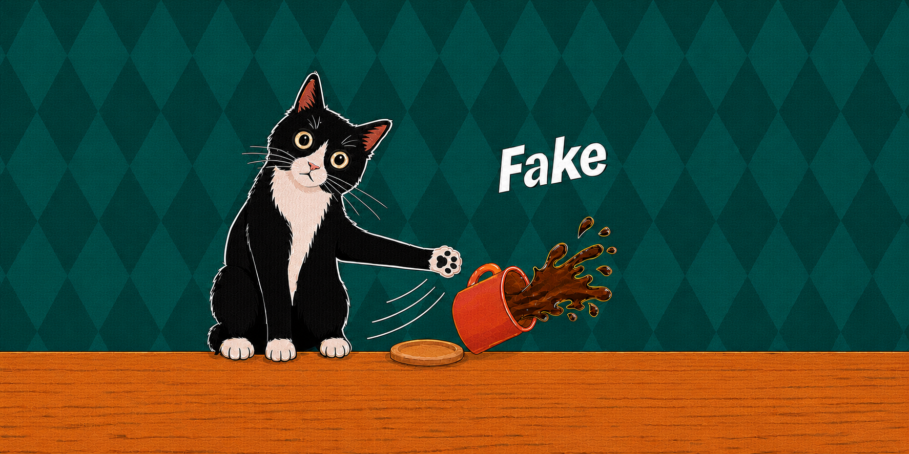

# ToppleCat

<p align="center">
  
</p>

<p align="center"><strong>Make every agent's “done” earn a PASS.</strong></p>

<p align="center"><a href="README.zh-TW.md">繁體中文</a> · <a href="LICENSE">Apache-2.0</a></p>

ToppleCat is a Java/JUnit delegation-verification gate for teams that ask AI
coding agents to implement a selected Spec while a human remains responsible
for acceptance. After the agent says the work is done, ToppleCat runs the
sealed executable acceptance contract. It records a current-run `PASS` only
when every required Gate passes, then gives the human Reviewer the evidence
behind that verdict.

Ordinary Java acceptance tests and typed JSON or YAML case rows are the source
of truth. Generated JSON and HTML explain what was checked; they never become a
second specification.

## A concrete example

A checkout Spec says that a 1,000-dollar order receives a 100-dollar discount.
The public example checks `1,000 -> 900`, but an implementation could hard-code
`900` and still pass it.

A Reviewer can prepare additional evidence before handing the work to the
agent:

- a reviewer-owned case such as `2,000 -> 1,900` or `999 -> no discount`;
- a Property such as “the payable total is never negative”; and
- managed Mutation Testing that asks whether the public Acceptance Method
  notices a changed boundary or arithmetic operation.

After implementation, ToppleCat runs each enabled safeguard independently and
shows all results together. A selected AC whose public acceptance lets an
attributed altered program pass fails Mutation Testing and the aggregate run;
only when every required Gate passes does ToppleCat record `PASS` for the
current run. The human reads the evidence and makes the delivery decision.
ToppleCat cannot infer a missing rule, such as a VIP discount that the Spec
never stated.

## How it fits into delivery

```text
human selects the Spec and prepares the executable contract
    -> Spec Review: confirm what will be checked
    -> AI agent implements with ordinary ./gradlew test feedback
    -> toppleCatVerify: produce fresh formal evidence
    -> Verification Report: show the current verdict and AC evidence
    -> human decides what happens to the delivery
```

Both HTML reports are for the human Reviewer. The Implementation Agent receives
the public contract and safe Gate-level feedback, never reviewer-owned cases or
either HTML report.

ToppleCat supplies commands, evidence, and reports. The team decides who runs
them and whether they run locally, in CI, or in another workflow.

## What ToppleCat checks

| Safeguard | Question | Gate |
| --- | --- | --- |
| **Hidden Tests** | Do independently chosen reviewer examples pass the same public Acceptance Method? | `REVIEWER_JUNIT` |
| **Property-Based Testing** | Does a human-approved invariant survive bounded generated inputs? | `PROPERTY` |
| **Mutation Testing** | Does each exact public Acceptance Method detect the managed-profile mutants it covered? | `MUTATION` |

The safeguards are independent: one never supplies evidence for another, and
their results are not blended into a quality score. Contract Integrity confirms
that the selected contract and verification policy still match the Mechanical
Seal. Expected Consumption separately checks that authored expected values were
actually asserted.

Formal Mutation Testing uses ToppleCat's fixed, versioned PIT profile and
preserves PIT's official outcomes. Project-specific PIT tasks remain separate
and never enter ToppleCat evidence. See the
[verification guide](docs/guide/verification-and-evidence.md#independent-formal-work).

When an AC's unchanged public acceptance misses an attributed mutation, its
report section shows the detected and undetected counts followed by cards for
only the undetected changes. The cards explain the change, source location, and
that the acceptance still passed; exact replacements are shown only when the
PIT description and unambiguous source line support them. These reviewer-only
details stay out of safe agent feedback. A compact `ⓘ` control beside Mutation
Testing and its unfamiliar card terms gives a short explanation in the selected
report language. Hover or focus reveals it; clicking or tapping keeps it open
until the Reviewer dismisses it. The visible result and the existing technical
disclosures remain readable without opening help.

## Quick start

ToppleCat 0.0.22 requires Java 25 and a compatible Gradle version.

```kotlin
plugins {
    java
    id("io.github.samzhu.topplecat") version "0.0.22"
}

dependencies {
    testImplementation("io.github.samzhu.topplecat:topplecat-junit:0.0.22")
    testImplementation("org.junit.jupiter:junit-jupiter:6.1.1")
    testRuntimeOnly("org.junit.platform:junit-platform-launcher:6.1.1")
}

tasks.test { useJUnitPlatform() }
```

Prepare and inspect the contract before implementation, then verify the same
selected Spec after the agent's done claim:

```bash
./gradlew toppleCatCheck --spec specs/checkout/spec.md
./gradlew toppleCatReview --spec specs/checkout/spec.md
./gradlew toppleCatSeal --spec specs/checkout/spec.md

./gradlew test
./gradlew toppleCatVerify --spec specs/checkout/spec.md
```

Reviewer HTML is English by default. To read ToppleCat-owned report prose in
Traditional Chinese, add `--language zh-TW` to `toppleCatReview`,
`toppleCatSeal`, `toppleCatReseal`, or `toppleCatVerify`. The choice applies
only to that invocation's HTML; authored text and canonical values such as AC
IDs, Gate names, verdicts, and PIT outcomes stay exactly as recorded.

Start with the [getting-started guide](docs/guide/getting-started.md) or run the
[JUnit sample](samples/junit-cart-orders).

## A minimal acceptance contract

Each Acceptance Condition has one public Java/JUnit Acceptance Method. The
method describes one ordered Scenario; ordinary Java Stage methods perform the
business calls and assertions.

```java
@ToppleAcceptanceTest("AC-CART-COUPON")
@DisplayName("Apply a coupon to an order")
void appliesCoupon(ToppleCase c, ToppleScenario scenario, CouponStage coupon) {
    scenario.given(coupon).a_cart(c.input("cart", Cart.class));
    scenario.when(coupon).creates_an_order();
    scenario.then(coupon).receipt_matches(c);
}
```

Typed rows provide the inputs and expected results:

```yaml
- caseId: coupon-at-threshold
  acId: AC-CART-COUPON
  inputs:
    cart: {subtotal: 1000}
  expected:
    receipt: {total: 900}
```

Public rows live under `src/test`; reviewer-owned rows use the same schema under
`src/hiddenTest`. See [Authoring contracts](docs/guide/authoring.md) for the
complete Java, Stage, case, expected-value, and Property rules.

## Read the result

| Artifact | Audience | Purpose |
| --- | --- | --- |
| `build/topplecat/reports/review/index.html` | Reviewer | Spec Review before handoff: the complete selected Spec and bound executable material, not an execution result. |
| `build/topplecat/reports/verification/index.html` | Reviewer | Verification Report for the current formal run, with AC-first results and private diagnostics. |
| `build/topplecat/evidence.json` | Reviewer / automation | Machine-readable current-run verdict and Gate digests. |
| `build/topplecat/agent-feedback.json` | Implementation Agent | Safe Gate-level remediation without reviewer answers. |

Both Reviewer HTML reports accept the same invocation-only `--language en` or
`--language zh-TW` presentation choice. This changes headings, accessibility
text, controls, explanations, and HTML language metadata, but never report
JSON, evidence, safe feedback, the Mechanical Seal, or the contract itself.
Verification Report uses plain reader outcomes before canonical technical
evidence. Failed cases show input and expected/actual differences first;
Scenario Steps, raw failures, Gate verdicts, and PIT details remain available
for deeper inspection. Every AC begins with its key result visible; use its
reading control for one AC or the report-wide control for incremental all-AC
reading. A failed or incomplete safeguard is emphasized with its recorded
plain-language reason; the fixed safeguard order and technical evidence remain
unchanged. Technical evidence remains independently collapsed, and linked AC
or safeguard targets are revealed before the report moves to them.

The aggregate verdict is:

- `PASS`: every required Gate passed for the selected ACs in the current run;
- `FAIL`: completed verification found a blocking AC or Gate problem; or
- `INCOMPLETE`: ToppleCat could not obtain enough trustworthy current-run
  evidence.

The human keeps the final decision in every case.

## Product boundaries

ToppleCat starts at the executable acceptance boundary:

- Humans or external workflows select the Spec and remain responsible for
  complete rules and cases.
- Teams own task state, Spec lifecycle, execution placement, PR policy,
  organizational approval, and sign-off.
- Ordinary unit and QA testing, project-specific PIT, performance programs, and
  security programs remain project concerns.
- Reviewer Custody is plaintext mechanical storage, not encryption, a sandbox,
  CI isolation, or operating-system security.

Read the canonical
[product definition](docs/product.md)
before proposing a new ToppleCat responsibility.

## Learn more

- [Getting started](docs/guide/getting-started.md)
- [Authoring contracts](docs/guide/authoring.md)
- [Verification and evidence](docs/guide/verification-and-evidence.md)
- [Product definition](docs/product.md)
- [Architecture](docs/architecture.md)
- [Context glossary](CONTEXT.md)
- [Documentation index](docs/README.md)
- [0.0.22 release notes](docs/releases/0.0.22.md)
- [JUnit sample](samples/junit-cart-orders)
- [Spring Boot sample](samples/spring-boot-cart-orders)

The repository also provides the
[`topplecat-acceptance`](.agents/skills/topplecat-acceptance/SKILL.md) skill
for turning selected ACs into executable Java acceptance methods, public and
reviewer case rows, and optional Properties. Humans or external workflow
automation remain responsible for running ToppleCat and deciding what to do
with its evidence.
